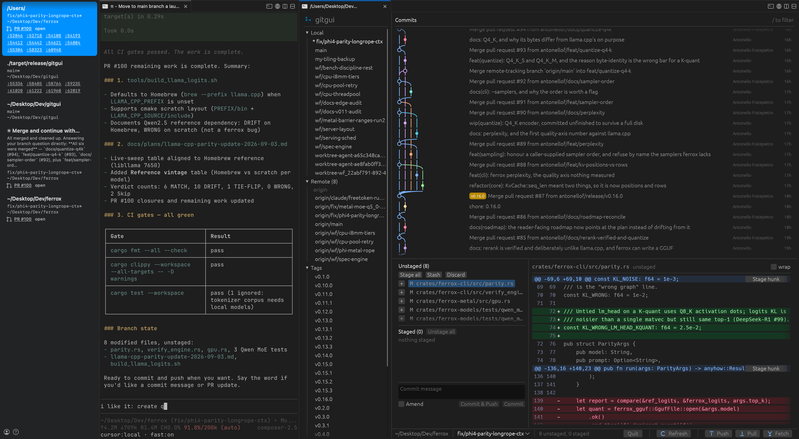
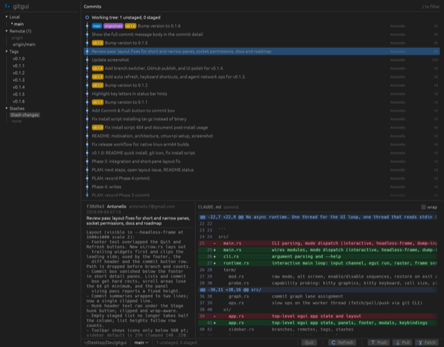
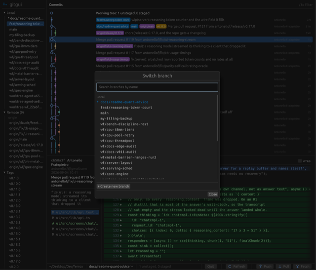
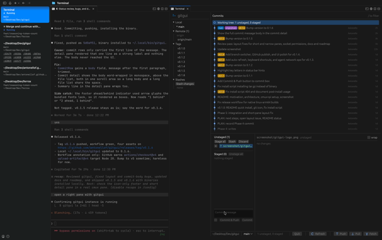
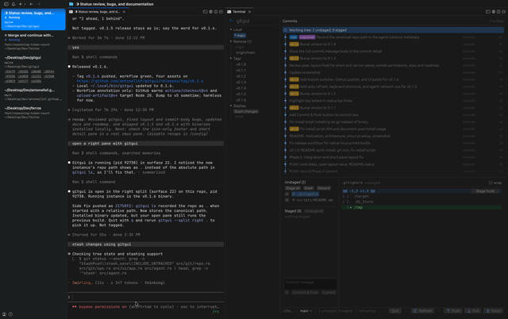
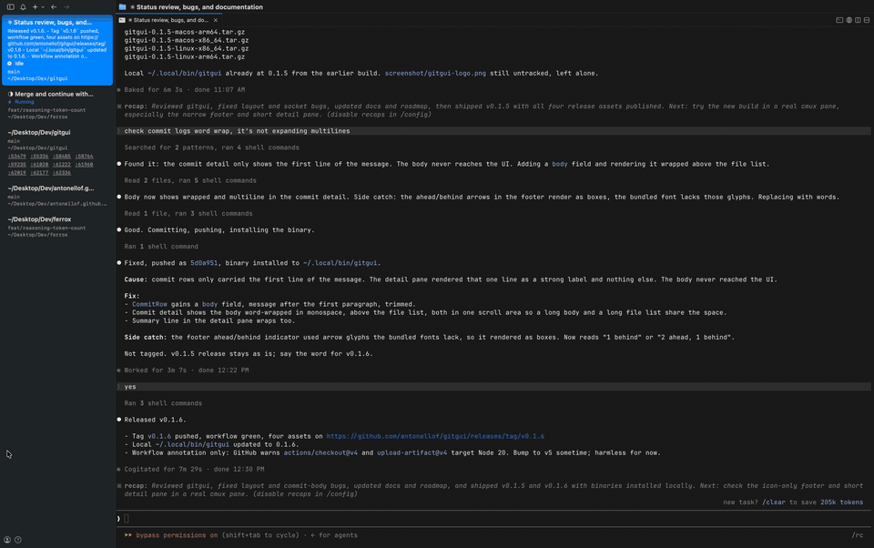
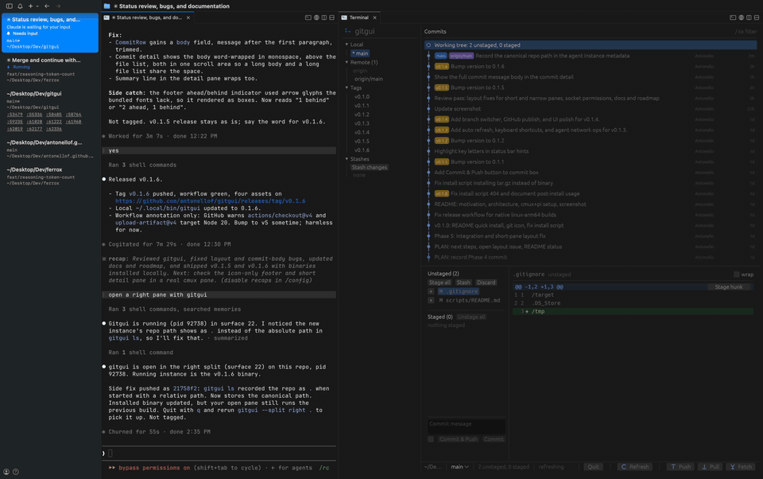

# gitgui

A git GUI that runs inside your terminal.



<p align="center">
  <a href="screenshot/gitgui-commits.png"></a>
  <a href="screenshot/gitgui-branches.png"></a>
  <a href="#demo-agent-opens-gitgui-in-a-split"></a>
  <a href="#demo-agent-drives-gitgui-through-the-skill"></a>
</p>
<p align="center">
  <sub>
    <a href="screenshot/gitgui-commits.png">commits and diff</a> ·
    <a href="screenshot/gitgui-branches.png">branch switcher</a> ·
    <a href="#demo-agent-opens-gitgui-in-a-split">demo: agent opens gitgui in a split</a> ·
    <a href="#demo-agent-drives-gitgui-through-the-skill">demo: agent drives gitgui through the skill</a>
  </sub>
</p>

### Demo: agent opens gitgui in a split

Claude Code in the left pane runs `gitgui --split right .`, then reviews, commits and cuts a release while gitgui refreshes on its own.



### Demo: agent drives gitgui through the skill

The agent reads `skill/SKILL.md` and uses `gitgui action` to inspect status, stage files and take screenshots of the pane.



<sub>HD versions: <a href="screenshot/gitgui-demo-1.mp4">demo 1 (mp4)</a> · <a href="screenshot/gitgui-demo-skill.mp4">skill demo (mp4)</a>. GitHub does not play repo-hosted video inline, so the README uses GIFs.</sub>

## Why

I live in [cmux](https://cmux.dev) (Ghostty-based terminal workspaces) and wanted a real git GUI in a pane next to my coding agent, not a separate Electron app or a text-mode TUI. gitgui renders pixels inside the terminal: commit graph, staging area, diff viewer, hunk staging, all in the same window as [pi](https://pi.dev) or any other CLI agent. One small Rust binary, no browser engine, works over SSH.

Not a TUI. gitgui paints an [egui](https://github.com/emilk/egui) interface into an RGBA framebuffer with its own software rasterizer and ships every frame to the terminal with the kitty graphics protocol.

## Quick install

Requires macOS or Linux and a kitty-graphics terminal (cmux, Ghostty, kitty, WezTerm).

**From a public clone** (works for private repos when you are logged in with `gh`):

```bash
gh repo clone antonellof/gitgui
cd gitgui
bash scripts/install.sh
```

The script downloads a release binary when one exists, otherwise builds from source with `cargo` (Rust 1.95+).

**One-liner** (public repo only; `curl` cannot fetch scripts or release assets from a private repo):

```bash
curl -fsSL https://raw.githubusercontent.com/antonellof/gitgui/main/scripts/install.sh | bash
```

Pin a version or install elsewhere:

```bash
GITGUI_VERSION=0.1.2 GITGUI_INSTALL_DIR=~/.local/bin bash scripts/install.sh
```

**Build from source directly** (Rust 1.95+):

```bash
git clone https://github.com/antonellof/gitgui
cd gitgui
cargo install --path .
```

### After install

On success the installer prints:

```
installed: ~/.local/bin/gitgui

run in a kitty-graphics terminal (cmux, Ghostty, kitty):
  gitgui                  open repo in current directory
  gitgui /path/to/repo    open a specific repo
  gitgui --split right .  open in a new terminal split

quit with q or Ctrl+C
```

If `gitgui` is not found, add the install dir to your PATH:

```bash
export PATH="$HOME/.local/bin:$PATH"
```

Verify the terminal supports kitty graphics:

```bash
gitgui --probe
```

### Run it

Open cmux, Ghostty, kitty, or WezTerm, then:

```bash
cd /path/to/your/repo
gitgui                    # current directory
gitgui --split right .    # new split beside your agent pane (cmux, kitty)
```

Inside gitgui: `j`/`k` to move, `s`/`u` to stage/unstage, `Ctrl+Enter` to commit, `q` or `Ctrl+C` to quit. See [Shortcuts](#shortcuts).

## cmux + pi + gitgui (AI coding setup)

This is the layout in the screenshot above: **pi** (or Cursor, Claude Code, Codex, etc.) in the left pane, **gitgui** in a right split, same workspace, same repo.

### 1. Install cmux

Install [cmux](https://cmux.dev) and open a workspace at your project path:

```bash
cmux /path/to/your/repo
```

cmux exposes `CMUX_SURFACE_ID`, kitty graphics, and pixel mouse in every terminal pane. That is what gitgui needs.

### 2. Install gitgui

Use the quick install above, or `cargo install --path .` from a clone.

Open gitgui in a split beside your agent pane:

```bash
gitgui --split right .
```

Under the hood this runs `cmux new-split right` and `cmux send` with the gitgui command. You can also split manually and run `gitgui` in the new pane.

### 3. Install pi (optional)

[pi](https://pi.dev) is a terminal coding agent. Install it however you prefer (Homebrew, npm: `@earendil-works/pi-coding-agent`), then start it in the main pane:

```bash
pi
```

Any agent that runs in a terminal pane works the same way. The point is two panes, one repo, agent on one side and gitgui on the other.

### 4. Give the agent gitgui skills

Copy or symlink the skill file so your agent knows the control API:

```bash
mkdir -p ~/.cursor/skills/gitgui
ln -sf "$(pwd)/skill/SKILL.md" ~/.cursor/skills/gitgui/SKILL.md
```

For pi, point it at the same `skill/SKILL.md` (or add it to pi's skills directory if you use one).

The agent can then:

```bash
gitgui ls
gitgui action '{"cmd":"status"}'
gitgui action '{"cmd":"select","oid":"abc123"}'
gitgui action '{"cmd":"stage","paths":["src/foo.rs"]}'
gitgui action '{"cmd":"screenshot","path":"/tmp/gitgui.png"}'
```

When run from the pane that owns a gitgui instance, `action` auto-connects via the controlling tty. Otherwise pass `--pid`.

### Typical workflow

1. Open cmux at the repo.
2. Start pi (or your agent) in the left pane.
3. Run `gitgui --split right .` from the agent pane, or open gitgui manually in a right split.
4. Agent edits code; you (or the agent via `gitgui action`) stage, review diffs, and commit in gitgui without leaving the terminal.

Suggested cmux keybind: map a workspace shortcut to `gitgui --split right .` if you open it often.

## Local development

To hack on gitgui itself with the same cmux setup:

```bash
git clone https://github.com/antonellof/gitgui
cd gitgui
cargo build --release
```

Run from a cmux pane (or any kitty-graphics terminal):

```bash
cargo run --release -- --repo /path/to/test/repo
cargo run --release -- --split right --repo .
```

Without a graphics terminal you can still verify rendering and git logic:

```bash
cargo test
cargo clippy -- -D warnings
cargo run --release -- --headless-frame /tmp/frame.png --repo . --size 1600x1000 --scale 2
bash scripts/smoke.sh
```

`--headless-frame` renders one PNG and exits. Use it in CI and to inspect layout without a live pane.

Interactive mouse testing in cmux: build `scripts/click.swift` (see [scripts/README.md](scripts/README.md)) because `cmux send` types text but cannot inject raw mouse events.

Release binaries are built by `.github/workflows/release.yml` on tag push (`v*`).

## What you get

- Commit graph with branch lanes, sidebar (branches, tags, stashes)
- Stage and unstage files and hunks, commit, amend
- Branch checkout, create, delete; stash push, pop, drop
- Fetch, pull, push (via your `git` CLI and credential helpers)
- Auto refresh every 2 s when the repo changes (no need to press `r` after edits in another pane)
- Agent control socket: `gitgui ls`, `gitgui action '{"cmd":"status"}'` (see [skill/SKILL.md](skill/SKILL.md))

Status: **v0.1.6**. Phases 0 to 5 of the roadmap are done. See [Roadmap](#roadmap) and [docs/PLAN.md](docs/PLAN.md) for open issues.

## Architecture

Single Rust binary (edition 2021, no async runtime). Three threads:

| Thread | Role |
|---|---|
| **stdin reader** | Blocking `read(2)` on stdin, pushes raw bytes to a channel |
| **main loop** | egui UI, tessellation, software rasterizer, kitty graphics frames |
| **git worker** | libgit2 reads and index writes; `git` CLI for fetch/pull/push |

The UI never blocks on git. It reads an immutable `RepoSnapshot` the worker replaces after each operation. Rendering never touches git.

```
  Terminal  ──stdin──►  term::input  ──Event──►  main loop
     ▲                                              │
     │  kitty graphics (shm or base64+zlib)         │ egui
     │                                              ▼
  term::kitty  ◄──  render::frame  ◄──  render::raster  ◄──  ui::app
                      (RGBA, dirty)      (mesh triangles)
                                              │
                                              ▼
                                         git worker (git2 + git CLI)
```

### Stack

| Layer | Technology |
|---|---|
| Language | Rust (stable, 1.95+) |
| UI | [egui](https://github.com/emilk/egui) 0.36 + [epaint](https://github.com/emilk/egui) (no eframe, no GPU) |
| Rasterizer | Custom software triangle rasterizer in `render/raster.rs` |
| Git | [libgit2](https://github.com/rust-lang/git2-rs) via `git2` 0.21 for reads and writes; `git` subprocess for network |
| Terminal | kitty graphics protocol, kitty keyboard, SGR pixel mouse, OSC 10/11 theme query |
| Transport | POSIX shared memory locally; flate2 + base64 over SSH |
| Agent API | Unix socket, JSON-lines (`src/agent.rs`) |
| Splits | cmux CLI, kitty `@ launch`, Ghostty hint fallback (`src/split.rs`) |

Pinned dependency versions and API notes live in [CLAUDE.md](CLAUDE.md). Full module map and milestones: [docs/SPEC.md](docs/SPEC.md). Escape sequences: [docs/PROTOCOLS.md](docs/PROTOCOLS.md).

Same idea as [terminal-browser](https://github.com/zenbu-labs/terminal-browser) and [terminal-code](https://github.com/zenbu-labs/terminal-code), minus Chromium.

## Usage

```
gitgui                    open the repository containing the current directory
gitgui <path>             open the repository at <path>
gitgui --split right      open in a new terminal split (cmux, kitty)
gitgui ls                 list running gitgui instances
gitgui action '{"cmd":"status"}'   control a running instance (see skill/SKILL.md)
gitgui --probe            print what the terminal supports and exit
gitgui --dump-input       print decoded key and mouse events, Ctrl+C to exit
gitgui --no-shm           force the base64 transport (what SSH uses)
gitgui --scale 2          override pixels per point (auto-detected from the cell height)
gitgui --font-size 14     UI font size in points
gitgui --help
```

## How does it work?

The terminal never sees any text. gitgui paints an egui interface into an RGBA framebuffer and ships every frame as a kitty graphics image covering the whole pane. Locally the frame goes through POSIX shared memory. Over SSH it falls back to zlib plus base64 inline.

Input: kitty keyboard protocol for keys, SGR pixel mouse for clicks, drags and wheel, bracketed paste, focus events, SIGWINCH for resize. Bytes are decoded into egui events.

Git access goes through libgit2 for reads and index writes. Network operations shell out to the `git` CLI so credential helpers and SSH agents keep working.

## SSH

Run `gitgui` on the remote machine inside an SSH session in a supported terminal. It detects `SSH_TTY`, switches to the inline transport and throttles to 20 fps. Nothing needs to be installed on the local side.

## Shortcuts

| Action | Key |
|---|---|
| Move selection | `j` / `k`, `Down` / `Up` |
| Open, checkout | `Enter` |
| Stage, unstage | `s` / `u` |
| Stage all, unstage all | `a` / `Shift+A` |
| Focus commit message | `c` |
| Commit | `Ctrl+Enter` |
| Commit and push | `Ctrl+Shift+Enter` |
| Stash | `Shift+S` |
| Filter commits | `/` |
| Clear filter, close modal | `Escape` |
| Fetch, pull, push | `f` / `p` / `Shift+P` |
| Refresh | `r` |
| Cycle panes | `Tab` |
| Quit | `q`, `Ctrl+C` |

Mouse: click files to view diffs, `+` / `-` to stage or unstage, `Stage hunk` on a hunk header, double-click a branch to check it out, right-click branches, tags and stashes for more. The footer shows the branch switcher, dirty counts, and the fetch / pull / push / refresh / quit buttons; in panes narrower than about 560 pt the buttons show icons only.

gitgui never binds `Cmd+*`. Most `Ctrl+Shift+*` combos stay with your terminal; the exception is `Ctrl+Shift+Enter` to commit and push from the commit box.

## Roadmap

- [x] Phase 0: terminal plumbing. Capability probe, raw mode, kitty graphics frame transport with shm and inline paths, clean restore on quit, panic and signals.
- [x] Phase 1: rendering. Software rasterizer for egui meshes, headless PNG frames.
- [x] Phase 2: input. Kitty keyboard, SGR pixel mouse, paste, focus, resize.
- [x] Phase 3: read-only git. Sidebar, commit graph, commit detail, diff view.
- [x] Phase 4: writes. Stage and unstage by file and hunk, commit, amend, branches, stash, fetch, pull, push.
- [x] Phase 5: integration. Split panes (cmux, kitty), agent control socket, install script, release workflow, agent skill file.

Post v0.1, in priority order (details and sizes in [docs/PLAN.md](docs/PLAN.md)):

- [x] Commit and push button and agent command (v0.1.1)
- [x] Auto refresh, keyboard shortcuts, agent network ops (v0.1.3)
- [x] Footer toolbar, branch picker, publish to GitHub, init screen (v0.1.4)
- [x] Layout fixes for short and narrow panes, owner-only agent socket, filter keeps a visible selection (v0.1.5)
- [x] Full commit message body in the commit detail (v0.1.6)
- [ ] Diff search and in-file navigation
- [ ] Conflict resolution UI: merge and rebase state, ours / theirs per hunk, abort
- [ ] Commit context menu: cherry-pick, revert, tag, branch here, reset
- [ ] Terminal font family matching (Ghostty `font-family` via CoreText / fontconfig)
- [ ] File history and blame
- [ ] tmux / Zellij graphics passthrough
- [ ] Remote add / remove, set upstream on push
- [ ] Recent repos switcher
- [x] README demo recordings (two videos under the hero screenshot)

Not planned: interactive rebase, bisect, submodules, worktrees. Use the git CLI in the neighbouring pane.

## Development

```
cargo test                          unit tests, byte-exact for every protocol encoder and parser
cargo clippy -- -D warnings
cargo run -- --probe                what does this terminal support?
cargo run --release -- --headless-frame /tmp/frame.png --size 1600x1000 --scale 2
                                    render one frame to a PNG without a terminal, prints timings
cargo run --release                 interactive
bash scripts/smoke.sh               headless smoke test without a graphics terminal
```

The design documents are the source of truth: [docs/SPEC.md](docs/SPEC.md) for architecture and milestones, [docs/PROTOCOLS.md](docs/PROTOCOLS.md) for the exact escape sequences.

tmux and Zellij are not supported yet (kitty graphics need passthrough). gitgui detects them and exits with a message.

## License

MIT
