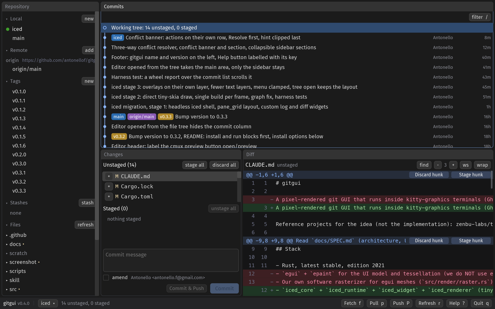
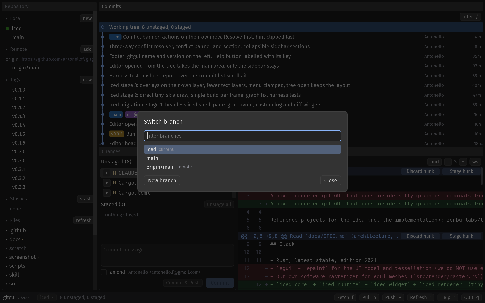

# gitgui

A git GUI that runs inside your terminal. One Rust binary paints an [egui](https://github.com/emilk/egui) interface as pixels into a cmux, Ghostty, kitty or WezTerm pane over the kitty graphics protocol. No Electron, no browser engine, no TUI. Works over SSH.

```bash
curl -fsSL https://raw.githubusercontent.com/antonellof/gitgui/main/scripts/install.sh | bash
cd /path/to/repo && gitgui
```


<p align="center">
  <a href="screenshot/gitgui-commits.png"></a>
  <a href="screenshot/gitgui-branches.png"></a>
</p>

<details>
<summary>Demos: an agent opens gitgui in a split and drives it through the skill</summary>

Claude Code runs `gitgui --split right .`, then reviews, commits and cuts a release while gitgui refreshes on its own.


The agent reads `skill/SKILL.md` and uses `gitgui action` to inspect status, stage files and take screenshots of the pane.


</details>

## Install

Requires macOS or Linux and a kitty-graphics terminal (cmux, Ghostty, kitty, WezTerm). The one-liner above downloads a release binary into `~/.local/bin`, or builds from source with `cargo` when there is no binary for your platform.

```bash
GITGUI_VERSION=0.2.0 GITGUI_INSTALL_DIR=~/bin bash scripts/install.sh   # pin a version, other dir
cargo install --git https://github.com/antonellof/gitgui                 # from source (Rust 1.95+)
gitgui --probe                                                           # does this terminal support kitty graphics?
```

If `gitgui` is not found afterwards, add `~/.local/bin` to your `PATH`.

## Use

```
gitgui                    open the repository containing the current directory
gitgui <path>             open the repository at <path>
gitgui --split right      open in a new terminal split next to your agent (cmux, kitty)
gitgui --open src/main.rs open a file in the built-in editor at startup
gitgui --editor "code -w" editor for Shift+E (or: git config gitgui.editor nano)
gitgui ls                 list running gitgui instances
gitgui action '{"cmd":"status"}'   control a running instance (see skill/SKILL.md)
gitgui --scale 2 --font-size 14    override pixels per point and font size
gitgui --probe | --dump-input | --no-shm | --help
```

Press `?` inside gitgui for every shortcut. The essentials: `j` / `k` move, `s` / `u` stage / unstage, `Ctrl+Enter` commit, `q` quit.

### With a coding agent

The screenshot above is [cmux](https://cmux.dev) with [pi](https://pi.dev) in the left pane and gitgui in a right split, same workspace, same repo. Any terminal agent (Claude Code, Codex, Cursor) works the same way:

```bash
cmux /path/to/your/repo        # open a cmux workspace
gitgui --split right .         # from the agent's pane: gitgui in a split beside it
```

Give the agent the control API by linking `skill/SKILL.md` into its skills directory (for Cursor: `~/.cursor/skills/gitgui/SKILL.md`). It can then run `gitgui action` to select commits, stage files, fetch, push and take screenshots of the pane. From the pane that owns the gitgui instance, `action` connects through the controlling tty; elsewhere pass `--pid`.

## Features

- **History**: commit graph with branch lanes, filter by summary / author / hash, full message body, files per commit.
- **Staging**: files, hunks and single lines; discard by file, hunk or line; commit, amend, commit and push; stash with keep-index / untracked options.
- **Commit menu**: cherry-pick, revert, tag, branch here, checkout detached, reset soft / mixed / hard, copy hash, open in browser.
- **History rewriting**: reword, squash, fixup, drop, move up / down, edit, autosquash. gitgui runs `git rebase` for you, no editor pops up.
- **Branches and remotes**: checkout, create, rename, delete, merge, rebase onto, fast-forward, upstream, delete on remote, open pull request; add / rename / edit / remove remotes; annotated and light tags; fetch, pull, pull with rebase, push, force push with lease through your `git` CLI so credential helpers and SSH agents keep working.
- **Merge and rebase state**: footer banner with continue / abort / skip; conflicted files show their markers and resolve with ours / theirs.
- **Diff**: search, adjustable context, whitespace toggle, word wrap, hunk and line selection with the mouse.
- **File tree**: the whole working tree in the sidebar, folders listed on demand, ignored entries dimmed, changed files colored.
- **Editor**: built-in, with syntax colors for the common languages, line numbers, undo, `Ctrl+S`. `Shift+E` opens the file in your own editor in a new split (GUI editors such as `code` open detached), `Shift+O` opens cmux's file preview.
- **Panels**: hide and show the sidebar, commit list and detail pane with `1` / `2` / `3` or the buttons in each header.
- **Refresh**: watches the repository and refreshes on its own when another pane changes it.
- **Agent API**: Unix socket, JSON lines, `gitgui ls` and `gitgui action`.

Not planned: an interactive rebase editor, bisect, submodules, worktrees. Use the git CLI in the neighbouring pane. Open items: [docs/PLAN.md](docs/PLAN.md).

## Shortcuts

| Action | Key |
|---|---|
| Move selection, open / checkout | `j` / `k`, `Enter` |
| Stage, unstage (file or selected lines), toggle | `s` / `u`, `Space` |
| Stage all, unstage all | `a` / `Shift+A` |
| Discard file or lines, discard everything | `d` / `Shift+D` |
| Ignore the selected untracked file | `i` |
| Edit (built-in), open in your editor, preview in cmux | `e`, `Shift+E`, `Shift+O` |
| Save, close the editor | `Ctrl+S`, `Escape` |
| Commit, commit and push, focus the message | `Ctrl+Enter`, `Ctrl+Shift+Enter`, `c` |
| Stash | `Shift+S` |
| Filter commits, search the diff, next / previous match | `/`, `Ctrl+F`, `n` / `Shift+N` |
| Diff context, whitespace | `{` / `}`, `Ctrl+W` |
| Branch, tag, cherry-pick, revert, reset at the commit | `n`, `Shift+T`, `Shift+C`, `t`, `g` |
| Reword, drop, move the commit | `Shift+R`, `d`, `Shift+K` / `Shift+J` |
| Copy hash, open commit in browser | `y`, `o` |
| Continue, abort or skip a merge / rebase | `m` |
| Fetch, pull, push, refresh | `f`, `p`, `Shift+P`, `r` |
| Cycle panes, hide / show sidebar, commits, detail | `Tab`, `1` / `2` / `3` |
| Clear filter, search or selection; close dialog | `Escape` |
| Help, quit | `?`, `q` or `Ctrl+C` |

Right-click commits, branches, remotes, tags, stashes and files for everything else. gitgui never binds `Cmd+*` and leaves `Ctrl+Shift+*` to the terminal, except `Ctrl+Shift+Enter`.

## How it works

Three threads, no async runtime: a stdin reader, the main loop (egui, tessellation, a software rasterizer in `render/raster.rs`, kitty graphics frames) and a git worker (libgit2 for reads and index writes, the `git` CLI for network and rebase). The UI reads an immutable snapshot the worker replaces after each operation; rendering never touches git.

Frames go through POSIX shared memory locally and zlib + base64 over SSH (detected from `SSH_TTY`, throttled to 20 fps). Input is the kitty keyboard protocol, SGR pixel mouse, bracketed paste, focus events and SIGWINCH. Colors follow the terminal palette (OSC 10 / 11).

| Layer | Technology |
|---|---|
| UI | egui 0.36 + epaint, no eframe, no GPU |
| Git | git2 0.21 (libgit2) for reads and writes, `git` subprocess for network |
| Terminal | kitty graphics, kitty keyboard, SGR pixel mouse |
| Splits | cmux CLI, kitty `@ launch`, Ghostty hint fallback |

Same trick as [terminal-browser](https://github.com/zenbu-labs/terminal-browser) and [terminal-code](https://github.com/zenbu-labs/terminal-code), minus Chromium. tmux and Zellij are not supported yet (kitty graphics need passthrough).

## Development

```
cargo test                              byte-exact tests for every protocol encoder and parser, git and UI harness tests
cargo clippy -- -D warnings
cargo run --release -- --headless-frame /tmp/frame.png --size 1600x1000 --scale 2 --open src/main.rs
                                        one PNG frame without a terminal, prints timings
bash scripts/smoke.sh                   headless smoke test
```

[docs/SPEC.md](docs/SPEC.md) is the source of truth for architecture and behavior, [docs/PROTOCOLS.md](docs/PROTOCOLS.md) for the exact escape sequences, [CLAUDE.md](CLAUDE.md) for pinned versions and API notes. Release binaries are built by `.github/workflows/release.yml` on a `v*` tag.

## License

MIT
