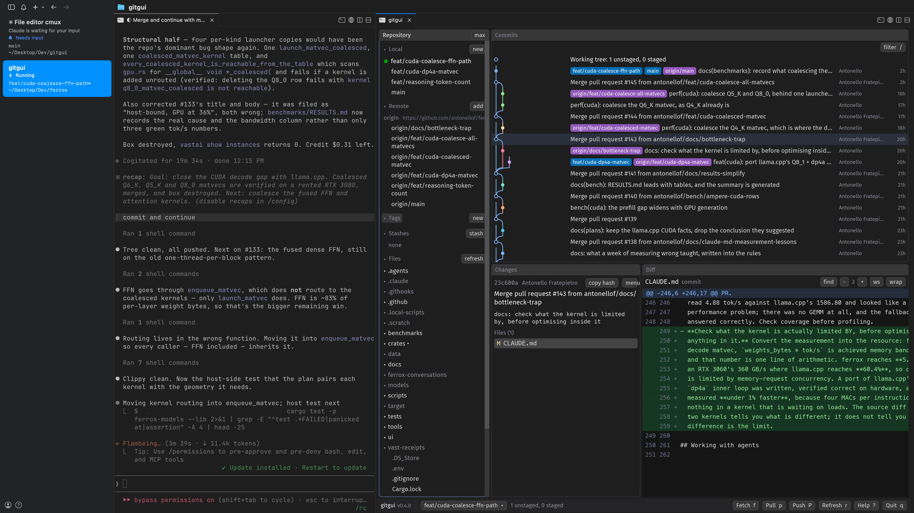
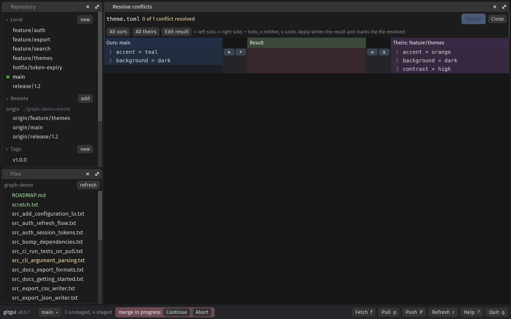
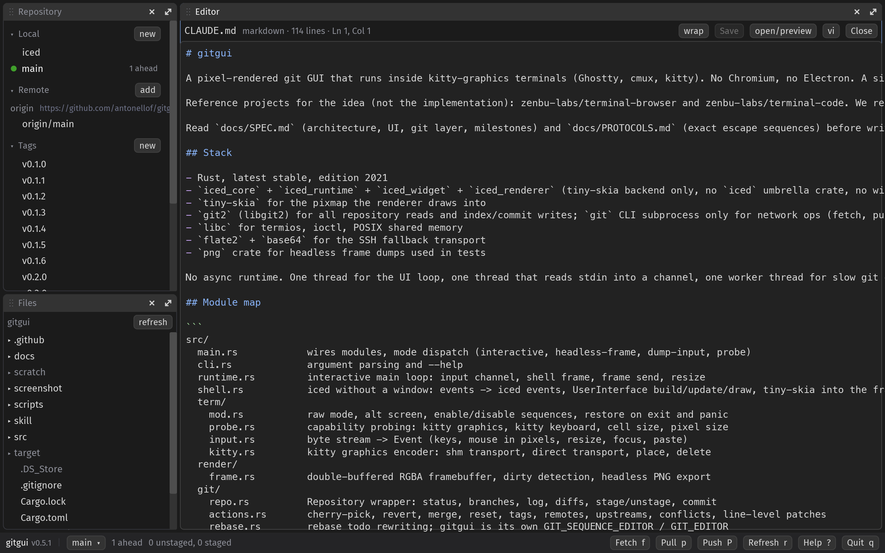
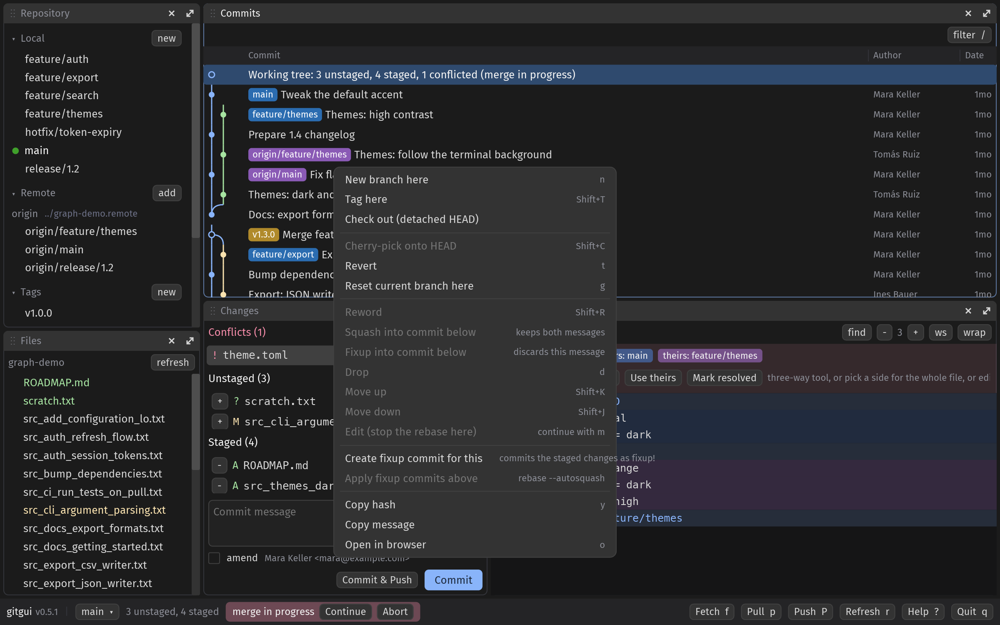
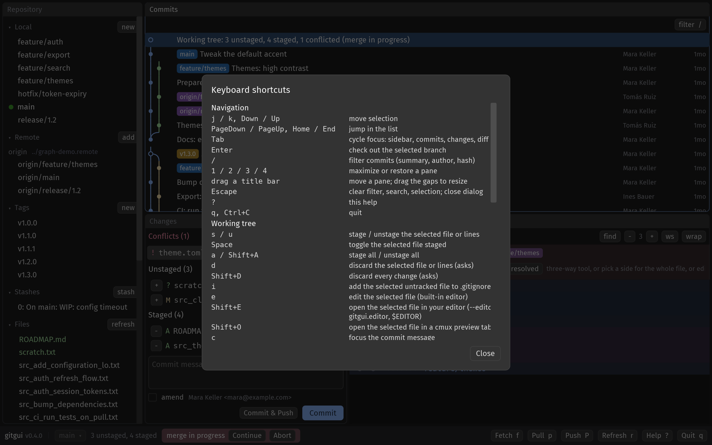

# gitgui

A git GUI that runs inside your terminal, next to your coding agent. One Rust binary paints an [iced](https://iced.rs) interface as pixels into a cmux, Ghostty, kitty or WezTerm pane over the kitty graphics protocol. No Electron, no browser engine, no TUI. Works over SSH. In any other terminal, or from Finder, the same binary opens a desktop window.


Install:

```bash
curl -fsSL https://raw.githubusercontent.com/antonellof/gitgui/main/scripts/install.sh | bash
```

Run:

```bash
cd /path/to/repo && gitgui
```



<p align="center">
  <a href="screenshot/gitgui-commits.png"></a>
</p>

Conflicts open a three-way resolver: ours, result, theirs, with per-conflict buttons, accept-all and apply.

<p align="center">
  <a href="screenshot/gitgui-merge.png"></a>
</p>

<p align="center">
  <a href="screenshot/gitgui-editor.png"></a>
  <a href="screenshot/gitgui-branches.png"></a>
  <a href="screenshot/gitgui-menu.png"></a>
  <a href="screenshot/gitgui-help.png"></a>
</p>
<p align="center">
  <sub>
    <a href="screenshot/gitgui-editor.png">editor</a> ·
    <a href="screenshot/gitgui-branches.png">branch switcher</a> ·
    <a href="screenshot/gitgui-menu.png">commit menu</a> ·
    <a href="screenshot/gitgui-help.png">shortcuts</a>
  </sub>
</p>

## Use

```
gitgui                    open the repository containing the current directory
gitgui <path>             open the repository at <path>
gitgui --split right      open in a new terminal split next to your agent (cmux, kitty)
gitgui --window           open a desktop window instead (automatic in terminals without kitty graphics)
gitgui --open src/main.rs open a file in the built-in editor at startup
gitgui --editor "code -w" editor for Shift+E (or: git config gitgui.editor nano)
gitgui ls                 list running gitgui instances
gitgui action '{"cmd":"status"}'   control a running instance (see skill/SKILL.md)
gitgui --scale 2 --font-size 14    override pixels per point and font size (Ctrl+= / Ctrl+- zoom at runtime)
gitgui --probe | --dump-input | --no-shm | --help
```

Press `?` inside gitgui for every shortcut. The essentials: `j` / `k` move, `s` / `u` stage / unstage, `Ctrl+Enter` commit, `q` quit.

### With a coding agent

The screenshot above is [cmux](https://cmux.dev) with [pi](https://pi.dev) in the left pane and gitgui in a right split, same workspace, same repo. Any terminal agent (Claude Code, Codex, Cursor) works the same way:

```bash
cmux /path/to/your/repo        # open a cmux workspace
gitgui --split right .         # from the agent's pane: gitgui in a split beside it
```

Give the agent the control API by linking `skill/SKILL.md` into its skills directory (for Cursor: `~/.cursor/skills/gitgui/SKILL.md`). It can then run `gitgui action` to select commits, stage files, fetch, push and take screenshots of the pane. From the pane that owns the gitgui instance, `action` connects through the controlling tty; elsewhere pass `--pid`.

## Features

- **History**: commit graph with branch lanes, filter by summary / author / hash, full message body, files per commit.
- **Staging**: files, hunks and single lines; discard by file, hunk or line; commit, amend, commit and push; stash with keep-index / untracked options.
- **Commit menu**: cherry-pick, revert, tag, branch here, checkout detached, reset soft / mixed / hard, copy hash, open in browser.
- **History rewriting**: reword, squash, fixup, drop, move up / down, edit, autosquash. gitgui runs `git rebase` for you, no editor pops up.
- **Branches and remotes**: checkout, create, rename, delete, merge, rebase onto, fast-forward, upstream, delete on remote, open pull request; add / rename / edit / remove remotes; annotated and light tags; fetch, pull, pull with rebase, push, force push with lease through your `git` CLI so credential helpers and SSH agents keep working.
- **Merge and rebase state**: footer banner with continue / abort / skip; conflicted files show their markers and resolve with ours / theirs.
- **Diff**: search, adjustable context, whitespace toggle, wrap toggle (diff and editor), hunk and line selection with the mouse. Drag over the text to select it and `Ctrl+C` copies it; the commit message body selects and copies the same way.
- **Conflict resolver**: a three-way merge tool (ours | result | theirs) with per-conflict take-left / take-right / keep-both / drop buttons, accept-all, edit the result, apply and mark resolved. Conflicted files also get a banner with whole-file ours / theirs.
- **Panes**: repository, files, commits, changes and diff on a pane grid. Drag a title bar to move a pane, drag the gaps to resize, maximize with the arrows or `1` .. `5`, hide with the x and bring it back from the footer (the x on the editor's pane closes the editor and restores the layout). The commit list's columns resize from its header. The layout, hidden panes, collapsed sections, wrap and diff settings are saved per repository in `.git/gitgui.json` and restored on the next start (`GITGUI_NO_STATE=1` skips this).
- **File tree**: its own pane with the whole working tree, folders listed on demand, ignored entries dimmed, changed files colored. Repository sections collapse from their arrow.
- **Editor**: built-in, on iced's text editor with syntax colors for the common languages, undo, `Ctrl+S`. Double-click a file in the change lists, press `e`, or click one in the file tree. A file opened from the tree takes the whole area next to the sidebar. `Shift+E` opens the file in your own editor in a new split (GUI editors such as `code` open detached), `Shift+O` opens cmux's file preview.
- **Desktop window**: the same UI in a native window with `--window`, or on its own when the terminal has no kitty graphics (Terminal.app, iTerm2, VS Code's terminal, tmux). Keys, panes, the state file and the agent API work the same; the terminal split and cmux preview do not apply. `scripts/bundle-macos.sh` wraps it as `gitgui.app` with the logo as its icon.
- **Open another repository**: `Ctrl+O`, the `Change folder` button in the footer, or the one on the not-a-repository screen. A folder dialog with the subfolders listed, git repositories marked, `..` to go up, or type a path.
- **SHA-256 repositories**: `git init --object-format=sha256` repositories open, read and commit like any other.
- **Refresh**: watches the repository and refreshes on its own when another pane changes it.
- **Agent API**: Unix socket, JSON lines, `gitgui ls` and `gitgui action`. Writes take an `id` so a retry after a lost response returns the first outcome instead of running twice; `status` reports `head` and the last operation's result.

Not planned: an interactive rebase editor, bisect, submodules, worktrees. Use the git CLI in the neighbouring pane. Open items: [docs/PLAN.md](docs/PLAN.md).

## Shortcuts

| Action | Key |
|---|---|
| Move selection, open / checkout | `j` / `k`, `Enter` |
| Stage, unstage (file or selected lines), toggle | `s` / `u`, `Space` |
| Stage all, unstage all | `a` / `Shift+A` |
| Discard file or lines, discard everything | `d` / `Shift+D` |
| Ignore the selected untracked file | `i` |
| Edit (built-in), open in your editor, preview in cmux | `e` or double-click, `Shift+E`, `Shift+O` |
| Save, close the editor | `Ctrl+S`, `Escape` |
| Undo, redo in any text field | `Ctrl+Z`, `Ctrl+Y` |
| Copy the text selected in the diff (or in any field) | `Ctrl+C` |
| Commit, commit and push, focus the message | `Ctrl+Enter`, `Ctrl+Shift+Enter`, `c` |
| Stash | `Shift+S` |
| Filter commits, search the diff, next / previous match | `/`, `Ctrl+F`, `n` / `Shift+N` |
| Diff context, whitespace | `{` / `}`, `Ctrl+W` |
| Branch, tag, cherry-pick, revert, reset at the commit | `n`, `Shift+T`, `Shift+C`, `t`, `g` |
| Reword, drop, move the commit | `Shift+R`, `d`, `Shift+K` / `Shift+J` |
| Copy hash, open commit in browser | `y`, `o` |
| Continue, abort or skip a merge / rebase | `m` |
| Fetch, pull, push, refresh | `f`, `p`, `Shift+P`, `r` |
| Open another repository | `Ctrl+O` |
| Zoom in, out, reset | `Ctrl+=`, `Ctrl+-`, `Ctrl+0` |
| Cycle panes, maximize / restore a pane | `Tab`, `1` .. `5` |
| Clear filter, search or selection; close dialog | `Escape` |
| Help, quit | `?`, `q` or `Ctrl+C` (in a text field `Ctrl+C` copies; three quick `Ctrl+C` always quit) |

Right-click commits, branches, remotes, tags, stashes and files for everything else. gitgui never binds `Cmd+*` and leaves `Ctrl+Shift+*` to the terminal, except `Ctrl+Shift+Enter`.

## How it works

Three threads, no async runtime: a stdin reader, the main loop (iced without a window, drawn by tiny-skia straight into the frame buffer, shipped as kitty graphics frames) and a git worker (libgit2 for reads and index writes, the `git` CLI for network and rebase). The UI reads an immutable snapshot the worker replaces after each operation; rendering never touches git.

Frames go through POSIX shared memory locally and zlib + base64 over SSH (detected from `SSH_TTY`, throttled to 20 fps). Input is the kitty keyboard protocol, SGR pixel mouse, bracketed paste, focus events and SIGWINCH. Colors follow the terminal palette (OSC 10 / 11).

| Layer | Technology |
|---|---|
| UI | iced 0.14 (`iced_core`, `iced_runtime`, `iced_widget`, `iced_renderer`), tiny-skia software renderer, no winit, no GPU |
| Git | git2 0.21 (libgit2, built with SHA-256 object support) for reads and writes, `git` subprocess for network |
| Terminal | kitty graphics, kitty keyboard, SGR pixel mouse |
| Splits | cmux CLI, kitty `@ launch`, Ghostty hint fallback |

Same trick as [terminal-browser](https://github.com/zenbu-labs/terminal-browser) and [terminal-code](https://github.com/zenbu-labs/terminal-code), minus Chromium. Under tmux, Zellij or a terminal without kitty graphics, gitgui opens a desktop window instead (winit + softbuffer, still the tiny-skia renderer, no GPU).

## Install options

Requires macOS or Linux. In-terminal rendering needs a kitty-graphics terminal (cmux, Ghostty, kitty, WezTerm); anywhere else gitgui opens a desktop window. The one-liner at the top downloads a release binary into `~/.local/bin`, or builds from source with `cargo` when there is no binary for your platform.

```bash
GITGUI_VERSION=0.7.6 GITGUI_INSTALL_DIR=~/bin bash scripts/install.sh   # pin a version, other dir
cargo install --git https://github.com/antonellof/gitgui                 # from source (Rust 1.95+)
gitgui --probe                                                           # does this terminal support kitty graphics?
```

If `gitgui` is not found afterwards, add `~/.local/bin` to your `PATH`.

## Development

```
cargo test                              byte-exact tests for every protocol encoder and parser, git and UI harness tests
cargo clippy -- -D warnings
cargo run --release -- --headless-frame /tmp/frame.png --size 1600x1000 --scale 2 --open src/main.rs
                                        one PNG frame without a terminal, prints timings
GITGUI_HEADLESS_OPEN=merge cargo run --release -- --headless-frame /tmp/merge.png --repo scratch/conflict-demo
                                        same, with a dialog or the merge tool open (picker, help, menu, stash, reset, merge)
scripts/conflict-demo.sh                a throwaway repository with three conflicted files
scripts/bundle-macos.sh                 dist/gitgui.app with the icon from assets/logo.png (Finder launch opens the desktop window)
scripts/graph-demo.sh                   a throwaway repository with branches, merges, tags, a remote, a stash and a conflict (the README screenshots)
bash scripts/smoke.sh                   headless smoke test
```

[docs/SPEC.md](docs/SPEC.md) is the source of truth for architecture and behavior, [docs/PROTOCOLS.md](docs/PROTOCOLS.md) for the exact escape sequences, [CLAUDE.md](CLAUDE.md) for pinned versions and API notes. Release binaries are built by `.github/workflows/release.yml` on a `v*` tag.

## License

MIT
